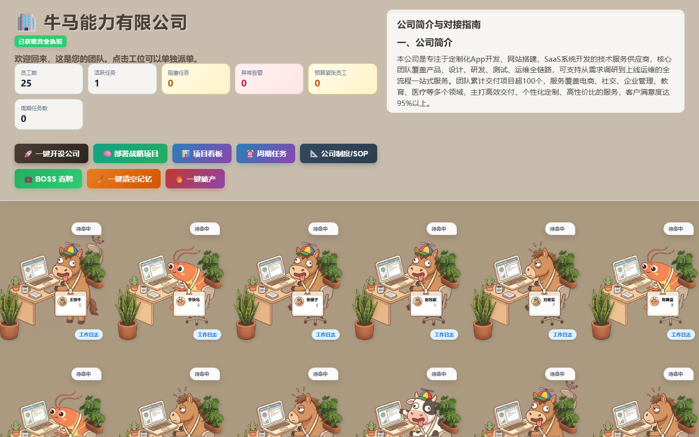
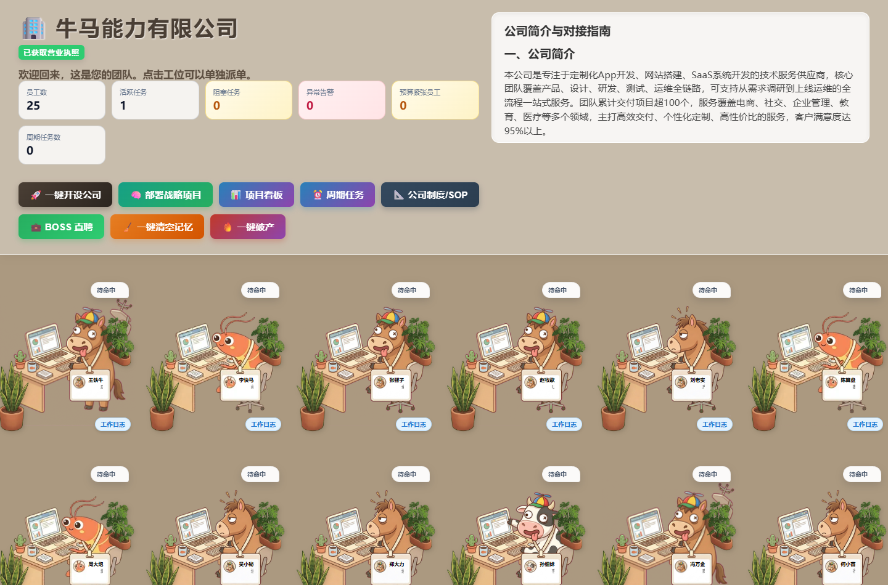
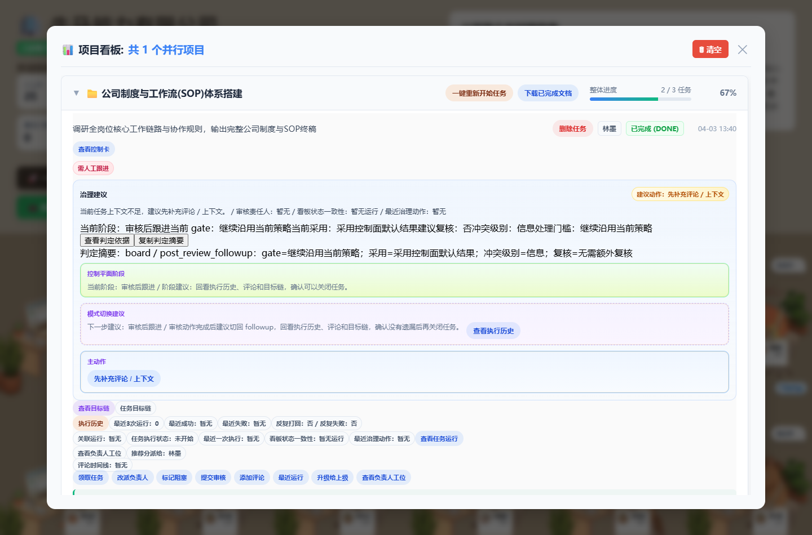
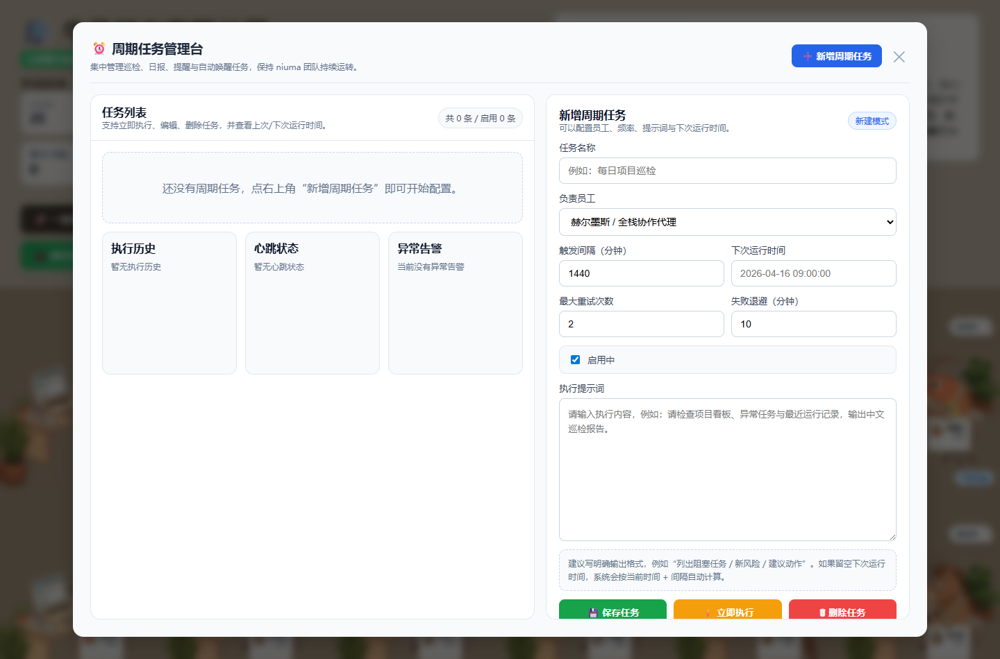

# NiumaClaw

<p align="center">
  <strong>面向一人公司与小团队的多 Agent 协同工作中控台。</strong>
</p>

<p align="center">
  
  
  
  
  
</p>

<p align="center">
  中文 | <a href="#english">English</a>
</p>

---



> 把多个 AI Agent 组织成可分工、可派工、可审批、可追踪、可交付的数字团队。

## 快速启动

```powershell
git clone https://github.com/Niumaclaw/Niumaclaw.git
cd Niumaclaw
dotnet run
```

启动后打开：

```text
http://localhost:4050/
```

## Demo

[观看 30-60 秒演示视频](docs/demo/niumaclaw-demo.webm)

## 试用上手

- [5 分钟快速开始](docs/QUICKSTART_5_MINUTES.md)
- [macOS / Windows 安装教程](docs/INSTALLATION_GUIDE.md)
- [Codex CLI 安装与登录说明](docs/CODEX_CLI_SETUP.md)
- [常见问题](docs/FAQ.md)

## 参与项目

- 路线图：[ROADMAP.md](ROADMAP.md)
- 问题反馈：[提交 Bug](https://github.com/Niumaclaw/Niumaclaw/issues/new?template=bug_report.yml)
- 功能建议：[提交 Feature Request](https://github.com/Niumaclaw/Niumaclaw/issues/new?template=feature_request.yml)
- 适合新贡献者的小任务：[Good First Issue](https://github.com/Niumaclaw/Niumaclaw/issues/new?template=good_first_issue.yml)
- 最新发布说明：[RELEASE_NOTES.md](RELEASE_NOTES.md)

---

## 简介

NiumaClaw 是一个基于 .NET 10 的本地多 Agent 协同工作平台。它把多个 AI Agent 组织成一个可视化团队：成员有工位、有角色、有节点地址、有工作状态，也能接收任务、持续执行、产出报告，并在看板里留下可追踪的任务记录。

项目的目标不是做一个单纯聊天窗口，而是把 AI Agent 变成更接近“数字员工”的工作台：你可以开设公司、招聘成员、派发任务、查看运行过程、管理周期任务、维护 SOP，并通过本地中控服务把请求转发到不同 Agent 节点。

本项目参考并延展了开源项目 [PiPiClaw.Team](https://github.com/anan1213095357/PiPiClaw.Team#-%E8%AE%B8%E5%8F%AF%E8%AF%81) 的设计与 MIT 开源许可说明，在此基础上重命名为 NiumaClaw，并继续扩展多 Agent 任务治理、看板、周期任务、运行追踪等能力。

---

## 预览

### 中控台首页



### 项目看板



### 周期任务



---

## 核心功能

| 功能 | 说明 |
| --- | --- |
| 可视化团队中控台 | 用办公桌、员工卡片、状态气泡展示多个 Agent 的在线状态、角色信息、执行状态和最新工作报告。 |
| 一键开设公司 | 通过公司初始化流程快速生成团队配置，让本地系统具备公司名称、成员结构和默认工作台。 |
| BOSS 直聘式成员管理 | 支持招募新 Agent、修改成员姓名/岗位/节点地址、查看候选简历、从人才市场招进团队，也可以移除或开除成员。 |
| 多 Agent 任务派发 | 选择指定成员后输入任务，系统会把请求转发到该 Agent 节点，并在界面内显示执行过程和最终结果。 |
| 流式工作日志 | 支持实时展示 Agent 执行中的阶段、工具调用、命令片段、产物列表、最终结果和可继续迭代的上下文。 |
| 项目看板 | 将战略任务拆解为可跟踪条目，支持任务状态、负责人、优先级、目标链路、运行绑定和治理操作。 |
| 战略项目部署 | 面向老板/CEO 视角输入战略需求，自动拆解为团队任务，并更新项目看板。 |
| 周期任务 | 可以创建定时/重复执行的工作项，维护任务标题、负责人、计划、执行历史和立即执行入口。 |
| 公司制度与 SOP | 支持维护团队工作制度、执行口径和流程规则，让 Agent 的工作方式更稳定。 |
| 运行详情追踪 | 查看单次 Agent 运行的步骤、状态、风险、审批、工具痕迹、产物路径和任务关联。 |
| 审批与治理 | 对高风险或需要人工确认的 Agent 操作提供批准、拒绝、复核优先、直接执行等治理入口。 |
| 告警与心跳 | 汇总任务异常、节点状态、心跳信息和恢复动作，便于发现卡住的任务或离线节点。 |
| 记忆管理 | 支持清空单个 Agent 或全部 Agent 的上下文记忆，适合重置工作状态或保护本地数据。 |
| 本地文件产物管理 | 工作日志可展示生成文件、路径、预览链接，并提供打开文件或定位文件夹的入口。 |
| Native AOT 发布 | 项目使用 .NET 10，可通过 Native AOT 发布为更轻量的本地可执行程序。 |

---

## 技术栈

| 模块 | 说明 |
| --- | --- |
| `.NET 10` | 本地 HTTP 服务、API 路由、配置读写与请求代理。 |
| Native AOT | 支持发布为本地可执行文件，减少运行时依赖。 |
| 原生 HTML/CSS/JavaScript | 前端界面直接内置，减少部署复杂度。 |
| JSON 配置 | 使用本地配置文件记录团队、节点、任务和运行状态。 |
| GitHub Actions | 提供跨平台构建与发布工作流。 |

---

## 安装与运行

环境要求：

- .NET 10 SDK
- Windows 10/11 或兼容 .NET 10 的桌面环境
- 一个或多个可通过 HTTP 访问的 Agent 节点

```powershell
git clone https://github.com/Niumaclaw/Niumaclaw.git
cd Niumaclaw
dotnet run
```

启动后打开：

```text
http://localhost:4050/
```

发布 Native AOT 版本：

```powershell
dotnet publish -c Release -r win-x64
```

---

## 配置说明

运行时会读取并维护 `team_config.json`。该文件通常包含本地 Agent 节点信息，默认不建议提交到公开仓库。

```json
{
  "PeerNodes": {
    "产品经理": {
      "url": "http://localhost:5050",
      "role": "需求拆解与项目推进"
    },
    "前端工程师": {
      "url": "http://localhost:5051",
      "role": "界面开发与交互实现"
    },
    "测试工程师": {
      "url": "http://localhost:5052",
      "role": "验证、回归与质量检查"
    }
  }
}
```

| 字段 | 说明 |
| --- | --- |
| `PeerNodes` | Agent 节点字典，键名为成员名称。 |
| `url` | Agent 节点服务地址。 |
| `role` | 成员职责或岗位描述。 |

---

## API 概览

| 路径 | 方法 | 描述 |
| --- | --- | --- |
| `/` | `GET` | 返回主界面。 |
| `/api/config` | `GET` | 获取团队成员与节点配置。 |
| `/api/config` | `POST` | 更新团队成员与节点配置。 |
| `/api/chat` | `POST` | 向指定 Agent 派发任务并返回流式响应。 |
| `/api/status` | `GET` | 查询 Agent 当前工作状态。 |
| `/api/history` | `GET` | 获取 Agent 历史对话、运行记录或工作报告。 |
| `/api/clear` | `POST` | 清空指定 Agent 的上下文记忆。 |
| `/api/clearall` | `POST` | 清空全部 Agent 的上下文记忆。 |
| `/api/tasks` | `GET` | 查询项目任务与负责人任务视图。 |
| `/api/routines` | `GET/POST` | 查询或保存周期任务。 |
| `/api/routines/history` | `GET` | 查看周期任务执行历史。 |
| `/api/agent/runs` | `GET` | 获取指定 Agent 的运行列表。 |
| `/api/agent/run` | `GET` | 查看单次运行详情。 |
| `/api/agent/approve` | `POST` | 批准需要人工确认的 Agent 操作。 |
| `/api/agent/reject` | `POST` | 拒绝需要人工确认的 Agent 操作。 |
| `/api/alerts` | `GET` | 获取异常、告警与恢复上下文。 |
| `/api/boss/list` | `GET` | 查看 BOSS 人才市场列表。 |
| `/api/boss/hire` | `POST` | 从人才市场招募 Agent。 |
| `/api/boss/upload` | `POST` | 上传当前 Agent 简历到人才市场。 |

---

## 项目结构

```text
NiumaClaw/
├── Program.cs
├── index.html
├── NiumaClaw.Team.csproj
├── Properties/
│   └── launchSettings.json
├── assets/
│   ├── avatars/
│   ├── redesign/
│   └── scenes/
├── docs/
│   └── screenshots/
├── img_shrimp_working.png
├── img_empty_desk.png
└── README.md
```

---

## 开源来源与许可

NiumaClaw 参考了 [PiPiClaw.Team](https://github.com/anan1213095357/PiPiClaw.Team#-%E8%AE%B8%E5%8F%AF%E8%AF%81) 的开源实现与项目说明。原项目采用 MIT License，本项目延续 MIT License 发布。

如果你基于本项目继续分发或二次开发，请保留必要的版权与许可说明，并在合适位置说明上游参考来源。

---

## 许可

本项目采用 MIT License，详见 [LICENSE](LICENSE)。

---

<h2 id="english">English</h2>

NiumaClaw is a local multi-agent control desk for solo founders and small teams. It turns multiple AI agents into a visual team with roles, seats, node URLs, task dispatching, execution logs, project boards, recurring jobs, SOP management, and governance controls.

This project is inspired by and extends the open-source project [PiPiClaw.Team](https://github.com/anan1213095357/PiPiClaw.Team#-%E8%AE%B8%E5%8F%AF%E8%AF%81), which is released under the MIT License. NiumaClaw continues under the MIT License.

```powershell
git clone https://github.com/Niumaclaw/Niumaclaw.git
cd Niumaclaw
dotnet run
```

Open `http://localhost:4050/` after the service starts.
